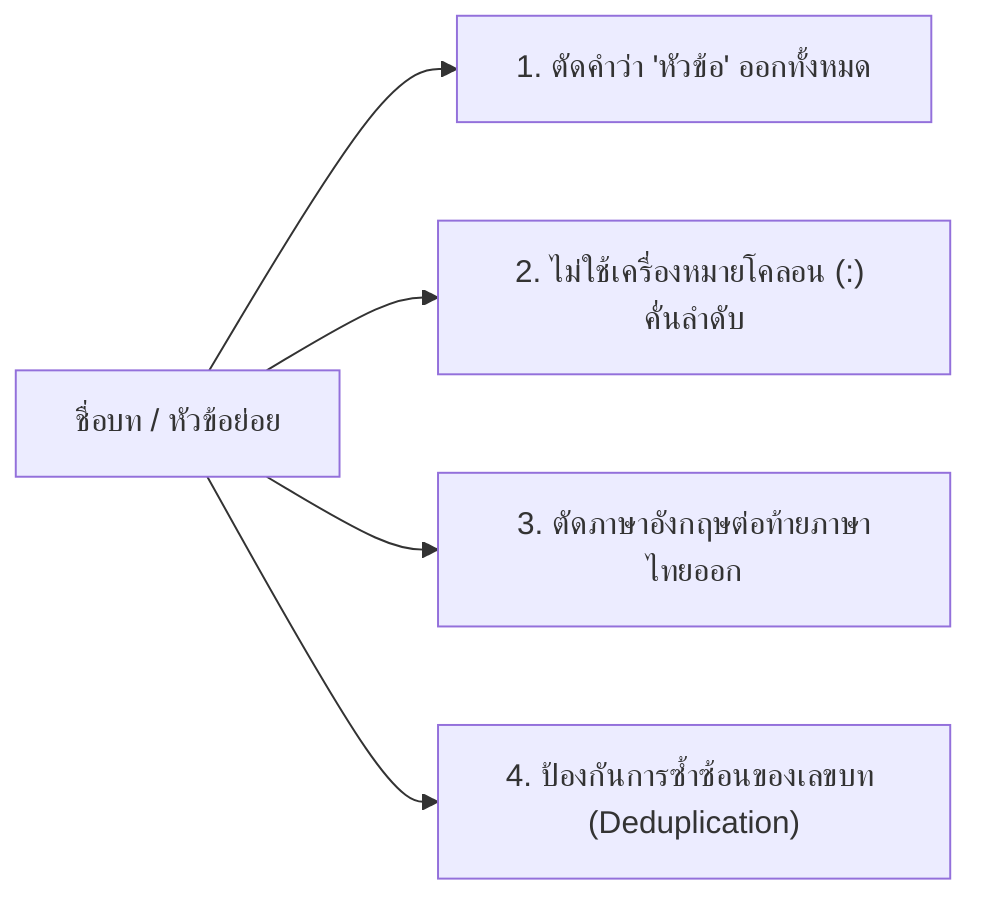
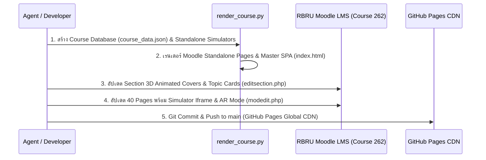

# 🎓 RBRU MOOC Course Builder (Masterclass 60 FPS, 3D Vector & AR Edition)

**RBRU MOOC Course Builder** คือมาตรฐานและระบบอัตโนมัติระดับมืออาชีพสำหรับคณาจารย์และนักพัฒนาระบบการเรียนรู้ มหาวิทยาลัยราชภัฏรำไพพรรณี (RBRU) เพื่อใช้ยกระดับหัวข้อการเรียนรู้ โครงร่างหลักสูตร เอกสารคำสอน และตำราเรียน ให้กลายเป็น **หลักสูตรออนไลน์เชิงปฏิบัติการระดับพรีเมียม (High-Grade Interactive MOOC / E-Learning Course)** บนระบบ [elearning.rbru.ac.th](https://elearning.rbru.ac.th) และ **GitHub Pages Global CDN Portal**

---

## 🏛️ 1. กฎการตั้งชื่อหัวข้อและภาษา (Clean Thai Naming & Deduplication Standard)



1. **ตัดคำว่า "หัวข้อ" หรือ "หัวข้อที่" ออกทั้งหมด**:
   * ❌ *ไม่ถูกต้อง:* `หัวข้อ 1.1 คณิตศาสตร์เชิงลึก`
   * ✅ *ถูกต้อง:* `1.1 คณิตศาสตร์เชิงลึก`
2. **ไม่ใส่เครื่องหมายทวิภาค (`:`) คั่นระหว่างลำดับและชื่อเรื่อง** (ใช้การเว้นวรรค 1 เคาะ):
   * ❌ *ไม่ถูกต้อง:* `บทที่ 1: การวัด หน่วย และเวกเตอร์:` หรือ `1.1: ปรากฏการณ์โฟโตอิเล็กทริก:`
   * ✅ *ถูกต้อง:* `บทที่ 1 การวัด หน่วย และเวกเตอร์` และ `1.1 ปรากฏการณ์โฟโตอิเล็กทริกและแนวคิดโฟตอน`
3. **ตัดคำแปลภาษาอังกฤษต่อท้ายภาษาไทยออกทั้งหมดจากชื่อหัวข้อหลักและหัวข้อย่อย**:
   * ❌ *ไม่ถูกต้อง:* `บทที่ 1 การวัดและเวกเตอร์ (Measurement & Vectors)`
   * ❌ *ไม่ถูกต้อง:* `1.3 ปรากฏการณ์โฟโตอิเล็กทริก (Photoelectric Effect)`
   * ✅ *ถูกต้อง:* `บทที่ 1 การวัดและเวกเตอร์` และ `1.3 ปรากฏการณ์โฟโตอิเล็กทริกและแนวคิดโฟตอนของไอน์สไตน์`
4. **ป้องกันการเกิดตัวเลขบทซ้ำซ้อน (Deduplication Algorithm)**:
   * เมื่อประมวลผลชื่อบทจาก JSON สู่ Moodle Section Name ให้ใช้การล้างข้อความนำหน้าเสมอ:
     ```python
     clean_title = re.sub(r'^(บทที่\s*\d+\s*|\d+\s*)', '', raw_title).strip()
     formatted_section_name = f"บทที่ {ch_id} {clean_title}"
     ```
   * ❌ *ไม่ถูกต้อง:* `บทที่ 2 2 ทฤษฎีสัมพัทธภาพพิเศษ`
   * ✅ *ถูกต้อง:* `บทที่ 2 ทฤษฎีสัมพัทธภาพพิเศษ`

---

## 🎨 2. มาตรฐานภาพปก 3D Animated SVG Cover ประจำแต่ละบท

ทุกบทเรียนในหน้า Section Overview ของ Moodle ต้องมี **3D Animated SVG Cover Banner** ขนาดเวกเตอร์ $760 \times 220$ ที่แสดงแอนิเมชันเชิงฟิสิกส์ต่อเนื่อง 60 FPS ด้วย CSS `@keyframes` โดยไม่ต้องพึ่งพาไฟล์ภาพภายนอก:

```html
<div class="cover-svg-wrapper">
  <svg class="cover-svg-anim" viewBox="0 0 760 220" fill="none" xmlns="http://www.w3.org/2000/svg">
    <!-- 1. Deep Space Gradient Background & 3D Perspective Grid -->
    <!-- 2. Animated Pulsing Quantum Cores / Light Cones / Relativistic Jets -->
    <!-- 3. Key Mathematical Formulas in JetBrains Mono -->
  </svg>
</div>

<style>
  @keyframes pulse-slow {
    0%, 100% { transform: scale(1); opacity: 0.85; }
    50% { transform: scale(1.08); opacity: 1.0; }
  }
  @keyframes spin-slow {
    from { transform: rotate(0deg); }
    to { transform: rotate(360deg); }
  }
  @keyframes dash-flow {
    to { stroke-dashoffset: -20; }
  }
  .anim-pulse { animation: pulse-slow 3s infinite ease-in-out; }
  .anim-spin-slow { transform-origin: center; animation: spin-slow 20s linear infinite; }
  .anim-ray { animation: dash-flow 1s linear infinite; }
</style>
```

---

## 🃏 3. ชุดการ์ด 3D Interactive Topic Cards Grid พร้อมลิงก์ตรงสู่บทเรียน

ในแต่ละ Section ของ Moodle ต้องแสดง **ชุดการ์ด 3 มิติ Glassmorphism (5 การ์ดต่อบท)** ที่มีคุณสมบัติดังนี้:
1. **3D Vector Icon:** ภาพเวกเตอร์ SVG 3 มิติที่เป็นเอกลักษณ์ประจำหัวข้อ
2. **Badge เลขหัวข้อและสูตรหลัก:** แสดงสมการสำคัญประจำหัวข้อ (เช่น $E=nhf, E=mc^2, \lambda=h/p, \Delta x\Delta p \ge \hbar/2$)
3. **ปุ่ม Direct Action Link:** ลิงก์ตรงสู่หน้ากิจกรรม Moodle (`mod/page/view.php?id={cmid}`) พร้อมเอฟเฟกต์ 3D Hover Lift และเรืองแสงสี Cyan

```html
<div class="topics-grid-3d">
  <div class="topic-card-3d">
    <div class="card-top-header">
      <div class="card-icon-3d">{SVG_ICON}</div>
      <div class="topic-badge">หัวข้อ 1.1</div>
    </div>
    <h3 class="topic-title">ข้อจำกัดของฟิสิกส์ดั้งเดิม</h3>
    <div class="formula-badge">I(λ) ∝ λ⁻⁴ (Rayleigh-Jeans)</div>
    <p class="topic-summary">การแผ่รังสีของวัตถุดำ ปริศนาความจุความร้อน และวิกฤตการณ์อัลตราไวโอเลต...</p>
    <a href="https://elearning.rbru.ac.th/mod/page/view.php?id=4909" class="btn-enter-lesson">
      <span>🚀 เข้าสู่บทเรียน & ปฏิบัติการจำลอง</span>
      <span class="arrow-icon">→</span>
    </a>
  </div>
</div>
```

---

## 🖐️ 4. สถาปัตยกรรมระบบควบคุมไร้สัมผัส AR MediaPipe Hands (60 FPS Multi-Modal)

ทุกห้องปฏิบัติการจำลองเสมือนจริง (`sim_X_Y.html`) ได้รับการติดตั้งโมดูล `ar_mediapipe_controller.js` เพื่อให้ผู้เรียนสามารถใช้มือสั่งการและทดลองได้แบบไร้สัมผัส:

```
                               ┌──────────────────────────────────────────────┐
                               │   Webcam Video Stream (PiP Feed 180x135)     │
                               └──────────────────────┬───────────────────────┘
                                                      │
                                                      ▼
                               ┌──────────────────────────────────────────────┐
                               │     MediaPipe Hands AI (21-Joint 3D Nodes)   │
                               └──────────────────────┬───────────────────────┘
                                                      │
                       ┌──────────────────────────────┼──────────────────────────────┐
                       │                              │                              │
                       ▼                              ▼                              ▼
          [☝️ Pointing & Dragging]        [🤏 Pinch Gesture Trigger]     [🖐️ Open Palm Fast Swipe]
         • คำนวณพิกัดปลายนิ้วชี้ (Landmark 8) • ระยะนิ้วชี้ถึงนิ้วโป้ง < 0.08   • ตรวจจับการปัดมือซ้าย-ขวา
         • เลื่อนปรับค่า Sliders อัตโนมัติ      • กดปุ่ม Action / ยิงเลเซอร์ /   • สลับแท็บ Lab ทันที
         • ซิงก์เสียงคลิกความถี่ 880 Hz          ชนโปรตอน พร้อมเสียง 1200 Hz   • ซิงก์เสียงสไวป์ 440 Hz
```

### การสังเคราะห์เสียง Web Audio API (Zero-External Asset):
* **Pinch Click:** `880 Hz Triangle Wave (40 ms)`
* **Action Trigger:** `1200 Hz Sine Wave (100 ms)`
* **Tab Swipe:** `440 Hz Sine Wave (150 ms)`
* **Laser / High Energy:** `1760 Hz Sawtooth Wave (200 ms)`

---

## 📐 5. โครงสร้างบทเรียน 5 ตอนย่อยมาตรฐาน (5 Deep Subtopics per Chapter)

ทุกบทเรียน (Chapter 1 ถึง Chapter N) ประกอบด้วย 5 หน้าย่อยที่ร้อยเรียงตามกระบวนทัศน์การเรียนรู้เชิงรุก (Active Learning Cycle: Input $\to$ Process $\to$ Output):

| ลำดับหน้า | รหัส | วัตถุประสงค์และสาระสำคัญ | องค์ประกอบในหน้า |
| :---: | :---: | :--- | :--- |
| **1** | `X.1` | **รากฐานทฤษฎีและที่มาเชิงลึก**: เปิดด้วยคำถามท้าทาย, ปริศนาธรรมชาติ, การพิสูจน์สูตร, SVG Vector Math | • แบนเนอร์หัวข้อ<br>• SVG Formula Cards<br>• **60 FPS Live Simulator 1 (AR Ready)**<br>• ตัวอย่างพร้อมปุ่มเปิด/ปิดเฉลย<br>• Concept Check Quiz |
| **2** | `X.2` | **กฎธรรมชาติและการพิสูจน์คณิตศาสตร์**: การวิเคราะห์สมการหลัก, ค่าคงตัวทางฟิสิกส์, กราฟิกแสดงความสัมพันธ์ | • ทฤษฎีเข้มข้น<br>• **60 FPS Live Simulator 2 (AR Ready)**<br>• ตัวอย่างคำนวณขั้นบันได<br>• Concept Check Quiz |
| **3** | `X.3` | **ปรากฏการณ์และการทดลองสำคัญ**: การทดลองประวัติศาสตร์, กลไกเชิงกายภาพ, การเชื่อมโยงปรากฏการณ์จริง | • แผนผังการทดลอง<br>• **60 FPS Live Simulator 3 (AR Ready)**<br>• ตัวอย่างวิเคราะห์ปรากฏการณ์<br>• Concept Check Quiz |
| **4** | `X.4` | **การวิเคราะห์สเปกตรัม/โครงสร้าง/โมเดล**: การสร้างแบบจำลอง, การถอดรหัสข้อมูล, การประยุกต์ทฤษฎี | • ตารางเปรียบเทียบ<br>• **60 FPS Live Simulator 4 (AR Ready)**<br>• ตัวอย่างประยุกต์ขั้นสูง<br>• Concept Check Quiz |
| **5** | `X.5` | **แบบฝึกหัดประเมินผล & ปฏิบัติการประยุกต์**: สรุปสาระสำคัญ, การประยุกต์ในอุตสาหกรรม/เทคโนโลยี, ทางเข้าห้องทดลอง 3D AR | • สรุป Mind Map<br>• **60 FPS Multi-Lab Simulator 5 (AR Ready)**<br>• ข้อสอบประเมินสัมฤทธิผล<br>• ปุ่มเปิดแล็บ 3D/AR เต็มจอ |

---

## ⚡ 6. ระบบ Deploy อัตโนมัติสู่ Moodle LMS & GitHub CDN Pipeline



---

## ⚙️ 7. Moodle 4.x Automation & Form Validation Rules (Critical)

เมื่อเขียนสคริปต์อัตโนมัติ (Python Requests / API Automation) เพื่อสร้างหรืออัปเดต Section Summary (`course/editsection.php`) หรือ Page Module (`course/modedit.php`):

1. **Availability Conditions JSON**:
   * Moodle 4.x จะเกิดข้อผิดพลาด 404 `Coding error detected: Invalid JSON from availabilityconditionsjson field` หากไม่มีคีย์นี้
   * **ต้องกำหนดค่าเสมอ:**
     ```python
     payload['availabilityconditionsjson'] = '{"op":"&","c":[],"showc":[]}'
     ```
2. **การกรอง Submit Buttons**:
   * ต้องตัดปุ่ม `cancel`, `submitbutton` (ตัวรอง), `unlockcompletion` (ปลดล็อกความสำเร็จ), `q`, `search`, และ `setmode` ออกจาก Payload POST
   * ส่งเฉพาะปุ่มหลัก เช่น `submitbutton` (สำหรับ editsection) หรือ `submitbutton2` (สำหรับ modedit: บันทึกและกลับไปยังรายวิชา)
3. **Moodle Atto Sanitizer Handling**:
   * ห้ามใช้ `srcdoc` ใน iframe เพราะตัวกรองความปลอดภัยของ Moodle จะตัดออก ให้ใช้ `src="https://.../simulators/sim_nano_X_Y.html?v=..."` ร่วมกับ Global CDN

---

## 🧮 8. มาตรฐานการแสดงสมการ Masterclass (Zero-Tofu Formula Cards)

เพื่อรับประกันความคมชัด 100% สวยงาม ไม่ซ้อนทับ และไม่เพี้ยนบนทุกเบราว์เซอร์และสมาร์ตโฟน:

1. **โครงสร้างการ์ดสมการ (Cyber Obsidian & Neon Glow)**:
   * พื้นหลังไล่เฉด `#090e1a` ถึง `#0f172a` ขอบซ้ายเรืองแสง `#00f0ff` (6px)
   * กล่องสูตรด้านใน `#020617` ขอบมน 12px ตัวอักษรสีเหลืองทองเรืองแสง `#facc15`
2. **โครงสร้างเศษส่วนแบบ Vector Division Bar**:
   ```html
   <span style="display:inline-flex; align-items:center; gap:8px;">
     <span style="display:inline-flex; flex-direction:column; vertical-align:middle; text-align:center;">
       <span style="border-bottom:2px solid #38bdf8; padding:0 6px; color:#facc15;">ตัวเศษ</span>
       <span style="color:#facc15;">ตัวส่วน</span>
     </span>
   </span>
   ```
3. **คำอธิบายตัวแปรและหน่วย SI**:
   * แสดงรายการตัวแปรหลักทุกตัวพร้อมระบุหน่วยวัดทางฟิสิกส์อย่างเป็นระเบียบชัดเจน
4. **กรอบนัยสำคัญทางกายภาพ (Physical Significance Callout)**:
   * สรุปใจความสำคัญของสูตรและการประยุกต์ใช้ในระดับนาโนสเกล

---

### การตั้งค่า Iframe บนหน้า Moodle:
```html
<iframe src="https://tsanaphy2023.github.io/<repo>/simulators/sim_X_Y.html?v=2026" style="width:100%; height:545px; border:1px solid #1e293b; border-radius:10px; background:#020617;" allow="accelerometer; autoplay; camera; gyroscope;"></iframe>
```
*(หมายเหตุ: ใส่พารามิเตอร์ `?v=2026` เสมอ เพื่อป้องกันปัญหาแคชของเบราว์เซอร์เก่า และใส่ `allow="camera;"` เพื่อรองรับ AR MediaPipe)*
